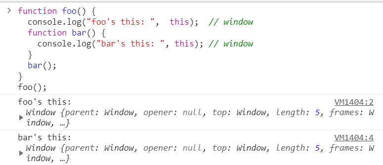

# 함수의 호출 방식에 의해 결정되는 this  
<pre>
<code>
function square(number){
    console.log(arguments);
    console.log(this);

    return number * number;
}

square(2);
</code>
</pre>  
자바스크립트의 함수는 호출될 때, 매개변수로 전달되는 인자값 이외에, `arguments객체`와 `this`를 암묵적으로 전달받습니다.  

</img>   
자바스크립트의 `this`키워드는 Java와 같은 익숙한 개념과 달라 개발자에게 혼란을 줍니다.  
  
# 함수 호출 방식과 this 바인딩  
자바스크립트의 경우 함수 호출 방식에 의해 `this`에 바인딩 할 어떤 객체가 동적으로 결정됩니다.  
함수를 선언할 때 this에 바인딩할 객체가 정적으로 결정되는 것이 아니고,  
함수를 `호출할 때 함수가 어떻게 호출되었는지에 따라` this에 바인딩 할 객체가 동적으로 결정됩니다.  
>함수의 상위 스코프를 결정하는 방식인 렉시컬 스코프(Lexical scope)는 함수를 선언할 때 결정됩니다.  
this 바인딩과 혼동하지 않도록 주의하여야 합니다.  
  
함수의 호출 방식은 아래와 같이 다양합니다.  
> 1.함수 호출  
> 2.메소드 호출  
> 3.생성자 함수 호출  
> 4.apply/call/bind 호출  
  
# 1.함수 호출  
전역객체(Global Object)는 모든 객체의 유일한 최상위 객체를 의미하며 일반적으로 Browser-side에서는 window, Server-side(Node.js)에서는 global 객체를 의미합니다.  
  
전역객체는 전역 스코프(Global Scope)를 갖는 전역변수(Global variable)를 프로퍼티로 소유합니다. 글로벌 영역에 선언한 함수는 전역객체의 프로퍼티로 접근할 수 있는 전역 변수의 메소드입니다.  
<pre>
<code>
var ga = 'Global variable';

console.log(ga);
console.log(window.ga);

function foo() {
  console.log('invoked!');
}
window.foo();
</code>
</pre>
>Global variable  
Global variable  
invoked!  
  
기본적으로 this는 전역객체(Global object)에 바인딩됩니다. 전역함수는 물론이고 심지어 내부함수의 경우도 this는 외부함수가 아닌 전역객체에 바인딩됩니다.  
  
<pre>
<code>
function foo() {
  console.log("foo's this: ",  this);  // window
  function bar() {
    console.log("bar's this: ", this); // window
  }
  bar();
}
foo();
</code>
</pre>  
</img>  
  
또한 메소드의 내부함수일 경우에도 `this`는 전역객체에 바인딩됩니다.
<pre>
<code>
var value = 1;

var obj = {
  value: 100,
  foo: function() {
    console.log("foo's this: ",  this);  // obj
    console.log("foo's this.value: ",  this.value); // 100
    function bar() {
      console.log("bar's this: ",  this); // window
      console.log("bar's this.value: ", this.value); // 1
    }
    bar();
  }
};

obj.foo();
</code>
</pre>
</img>   
  
콜백함수의 경우에도 this는 전역객체에 바인딩됩니다.  
<pre>
<code>
var value = 1;

var obj = {
  value: 100,
  foo: function() {
    setTimeout(function() {
      console.log("callback's this: ",  this);  // window
      console.log("callback's this.value: ",  this.value); // 1
    }, 100);
  }
};

obj.foo();
</code>
</pre>
</img>   

`내부함수는 일반 함수, 메소드, 콜백함수 어디에서 선언되었든 관게없이 this는 전역객체를 바인딩한다.`  
더글라스 크락포드는 “이것은 설계 단계의 결함으로 메소드가 내부함수를 사용하여 자신의 작업을 돕게 할 수 없다는 것을 의미한다” 말합니다.  
내부함수의 ***this***가 전역객체를 참조하는 것을 회피방법은 아래와 같습니다.  

<pre>
<code>
var value = 1;

var obj = {
  value: 100,
  foo: function() {
    var that = this;  // Workaround : this === obj

    console.log("foo's this: ",  this);  // obj
    console.log("foo's this.value: ",  this.value); // 100
    function bar() {
      console.log("bar's this: ",  this); // window
      console.log("bar's this.value: ", this.value); // 1

      console.log("bar's that: ",  that); // obj
      console.log("bar's that.value: ", that.value); // 100
    }
    bar();
  }
};

obj.foo();
</code>
</pre>
</img>   
</img>   
  
# 2.메소드 호출  
함수가 객체의 프로퍼티 값이면 메소드로서 호출됩니다. 이때 메소드 내부의 this는 해당 메소드를 소유한 객체,  
즉 해당 메소드를 호출한 객체에 바인딩됩니다.  
<pre>
<code>
var obj1 = {
  name: 'Lee',
  sayName: function() {
    console.log(this.name);
  }
}

var obj2 = {
  name: 'Kim'
}

obj2.sayName = obj1.sayName;

obj1.sayName();
obj2.sayName();
</code>
</pre>
>Lee  
Kim  

</img>   

# 간단 정리  
## 전역 공간 >>>>> window / global  
## 함수 내부 >>>>> window / global  
## 메소드 호출 시 >>>> 메소드 호출 주체(메소드명 앞)  
## callback에서 >>>> 기본적으로는 함수내부에서와 동일  
## 생성자함수에서 >>>> 인스턴스